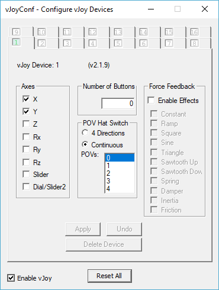

## Basic instructions

  * Install vJoy and make sure the first vJoy device has an X and Y knob. below is an example configuration of a 
  device with only X and Y axis
  
  
  
  * Run the server.py script with Python 3+
  ```
  python server.py
  ```
  
  * Import the sdvxknobs/project.godot file in Godot
  * Change the IP address in [Main.gd](https://github.com/pckv/sdvxknobs/blob/master/Main.gd) 
    to the address of your computer. this is the address printed by the python script.
  * Export the Android application as apk and transfer it to your phone (you can find up a 
    tutorial on how to export to Android with Godot in their documentation or on YouTube)
  * Install the .apk on your phone.

If the python script is running, the knobs in the Android app should tweak the joystick of your vJoy device.
  
## Todo
It would be convenient if an APK build was included in a release, but currently the IP address is hardcoded in the source 
file. The application should perhaps provide an input box for IP and port configuration on startup, or a configuration file.
